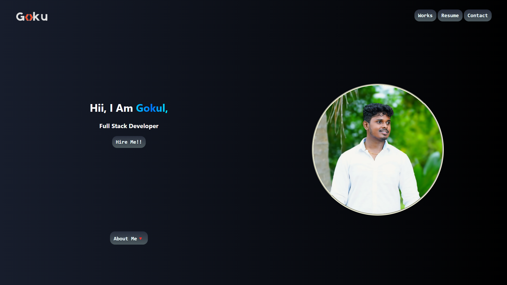
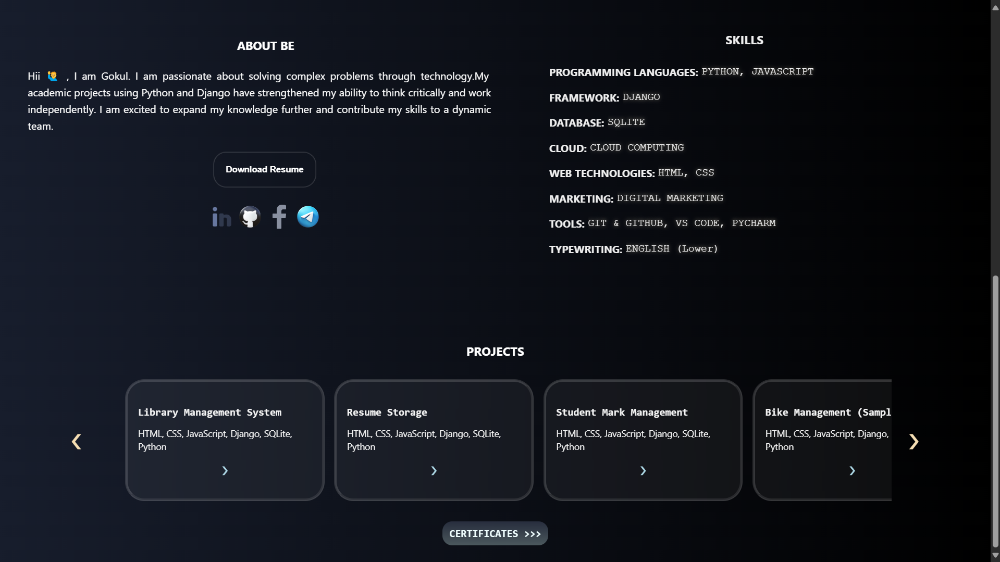
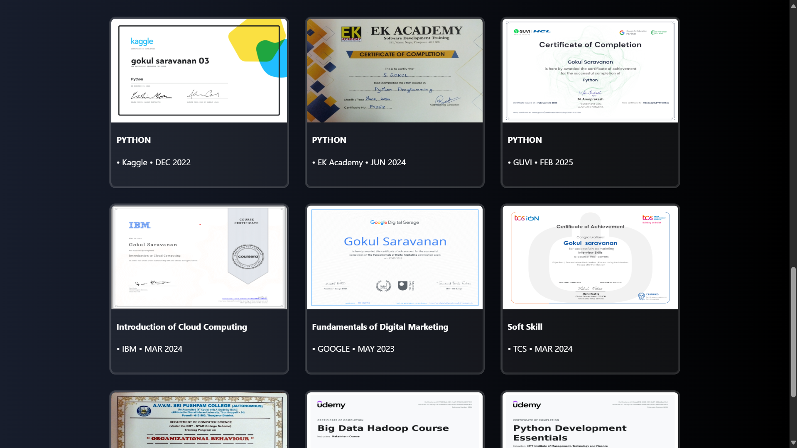
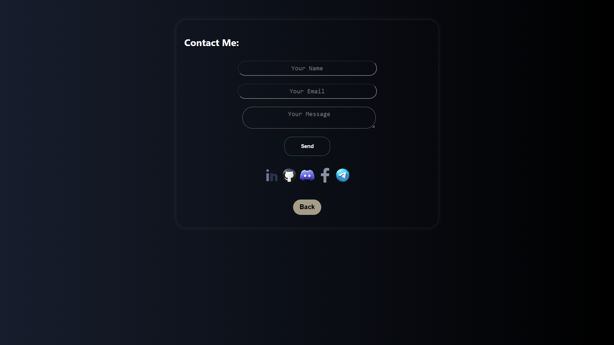

# Portfolio Website

This is my personal portfolio website showcasing my skills 😊, projects 🖥️, and experience 👨‍💻 in web development.

## Features
- Responsive design for Mobile, tablet, and desktop
- About me section with education and skills
- Contact form for inquiries

## Technologies Used
- HTML
- CSS 
- JavaScript
- Git & GitHub for version control

## Installation
1. Clone the repository:
   ```bash
   git clone https://github.com/GOKUL988/Portfolio_web.git
   ```
2. Navigate to the project folder:
   ```bash
   cd portfolio_web
   ```

## Deployment
The portfolio website is hosted on https://gokul988.github.io/Portfolio_web/

## Contact
Feel free to connect with me:
- Email: gs164945@gmail.com
- LinkedIn: www.linkedin.com/in/gokul-saravanan-062375277

## Screenshots
LAPTOP SCREEN VIEWS

##

##

##

##
MOBILE SCREEN VIEWS

##

##

##

##

##

##

## License
This project is open-source and available under the [MIT License](LICENSE).


